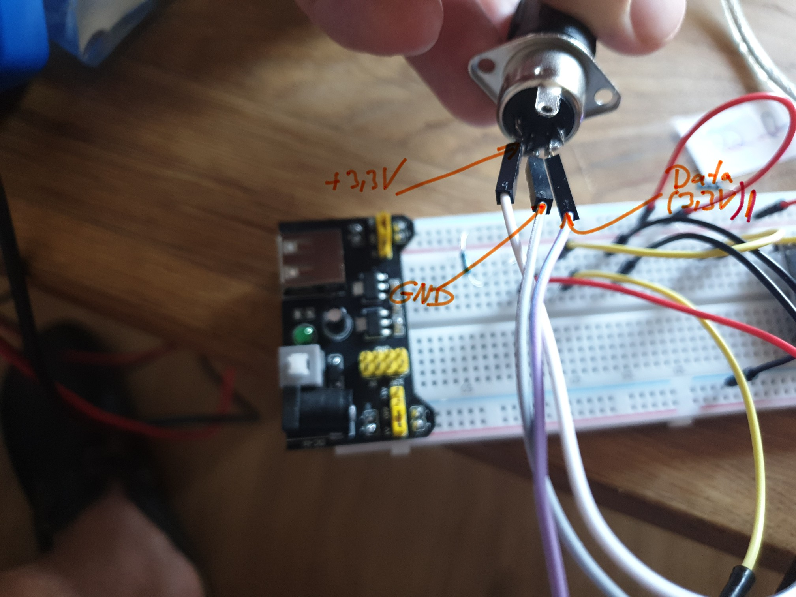
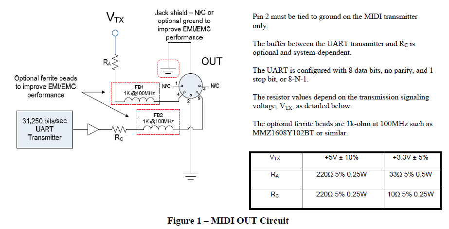
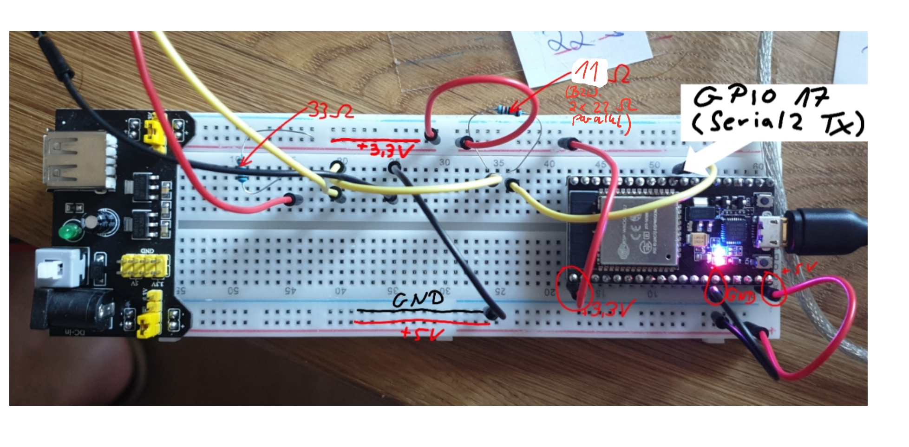
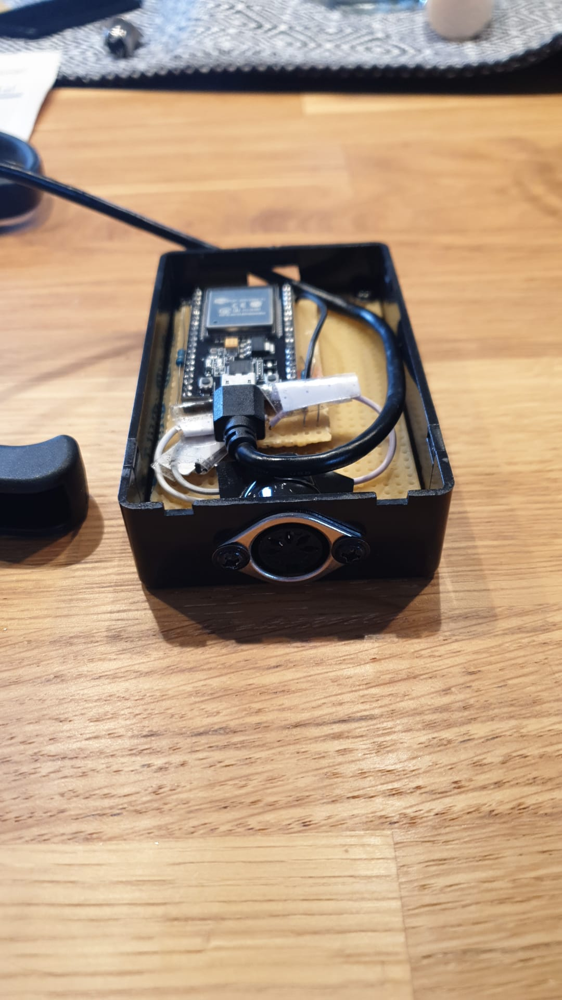
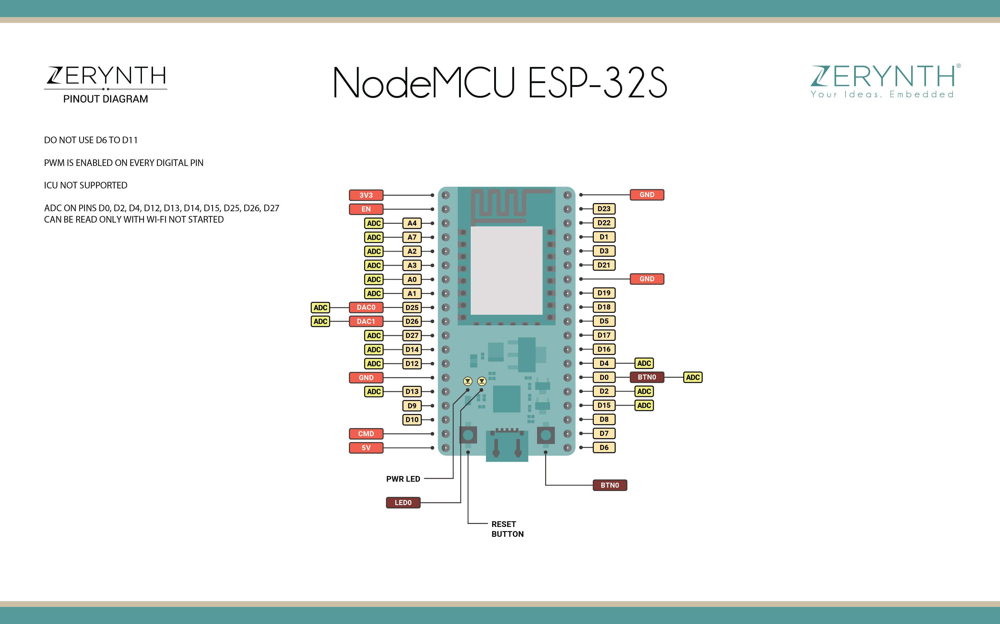
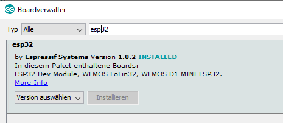

# Arduino-ESP32-Midi-BLE-Proxy

## What is it?
This code makes your ESP32 act as a simple proxy which takes MIDI
commands from a Bluetooth Low Engergy (BLE) device (like a tablet or smartphone)
and sends the MIDI commands out to the gear which is wired
to your ESP32. This code uses the [`Arduino-BLE-MIDI`](https://github.com/lathoub/Arduino-BLE-MIDI)
library in Version `2.1.0`. Also the
ESP32 core (board) is needed like described below.

## Hardware
<p align="center">
  
</p>
<p align="center">
  
</p>
<p align="center">
  
</p>
<p align="center">
  
</p>

<p align="center">
  
</p>

## Compile
You can compile the source code like any other Arduino sketch by using the Arduino IDE. If you like 
you can also use VSCode in combination with the [Arduino plugin](https://marketplace.visualstudio.com/items?itemName=vsciot-vscode.vscode-arduino). A matching board configuration is
available in `.vscode/arduino.json`.

1. Create a directory `MIDI_BLE_PROXY` and clone this repo 
```bash
mkdir MIDI_BLE_PROXY
cd MIDI_BLE_PROXY
git clone https://github.com/R0Wi/Arduino-ESP32-Midi-BLE-Proxy.git .
```
2. Copy the content of the `lib` folder into your Arduino libraries folder
(for example to `~/Arduino/libraries`). This will ensure that the 
`Arduino-BLE-MIDI` and it's dependencies are correctly installed on your system.
Alternatively you can download the `Arduino-BLE-MIDI` version `2.1.0` through the Arduino IDE library manager
using this link: https://www.ardu-badge.com/BLE-MIDI. 
3. Open Arduino IDE and install ESP32 board
<p align="center">
  
</p>

> This step will also install the BLE core libraries from https://github.com/espressif/arduino-esp32/tree/master/libraries/BLE used in the sourcecode. Read more about boards [here](https://support.arduino.cc/hc/en-us/articles/360012076960-Where-are-the-installed-cores-located-).

3. Under `Tools`->`Board` choose `DOIT ESP32 DEVKIT V1`
4. Compile & have fun.